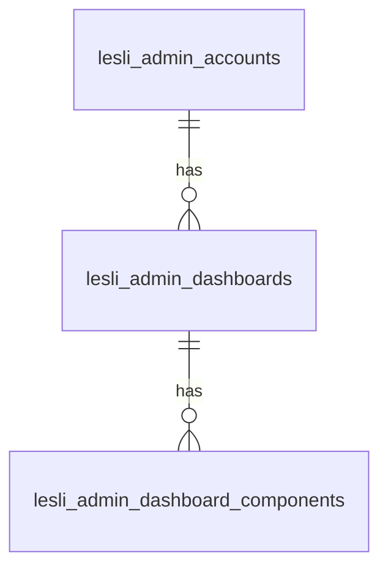

# 01.01 CloudBabel Database

```plaintext
    00.01. accounts
    05.01. dashboards
    05.02. dashboard/components
```



<section class="lesli-documentation-footer">
    <p><a><i class="ri-external-link-fill"></i>&nbsp;Edit this page</a><p/>
    <p><b>Last Update: </b>2024/11/11 04:31</p>
</section>
<!-- This code was automatically generated -->
<!-- to update this docs please run rake docs:build -->
