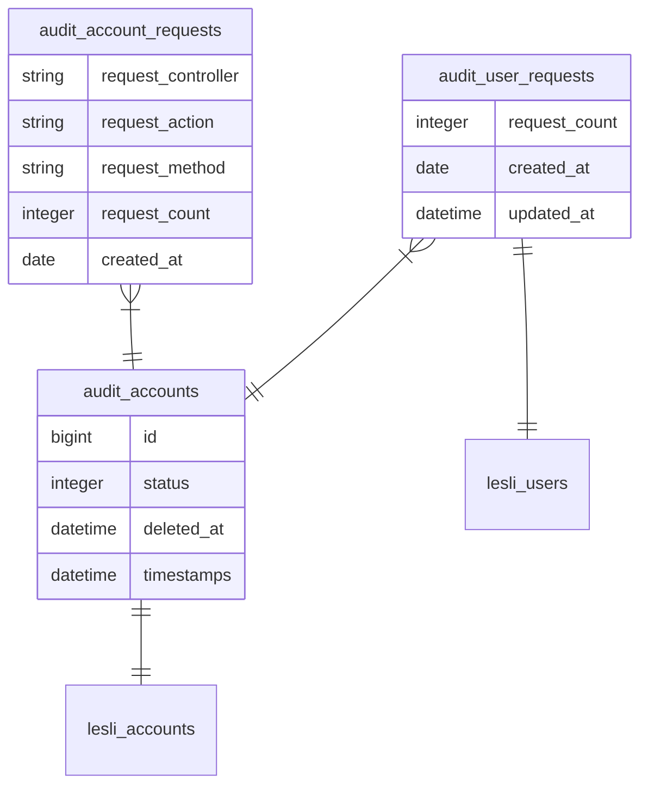

<p align="center">
    
</p>

<h3 align="center">Lesli Audit database</h3>

### 08.03. Audit
```plaintext
00.01. audit/account

05.01. audit/dashboards 
05.02. audit/dasboard/components 

10.00. audit/account_requests
11.00. audit/user_requests
```


<fieldset>


</fieldset>
<section class="lesli-documentation-footer">
    <p><a><i class="ri-external-link-fill"></i>&nbsp;Edit this page</a><p/>
    <p><b>Last Update: </b>2024/11/11 04:20</p>
</section>
<!-- This code was automatically generated -->
<!-- to update this docs please run rake docs:build -->
