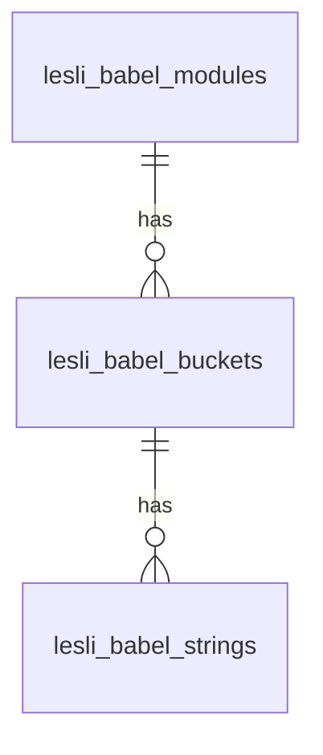

# 09.01 CloudBabel Database

```plaintext
    10.01. modules

    11.01. buckets

    12.01. strings
    12.04. string/activities
```



```mermaid
erDiagram
    lesli_babel_modules ||--o{ lesli_babel_buckets : has
    lesli_babel_buckets ||--o{ lesli_babel_strings : has
```
