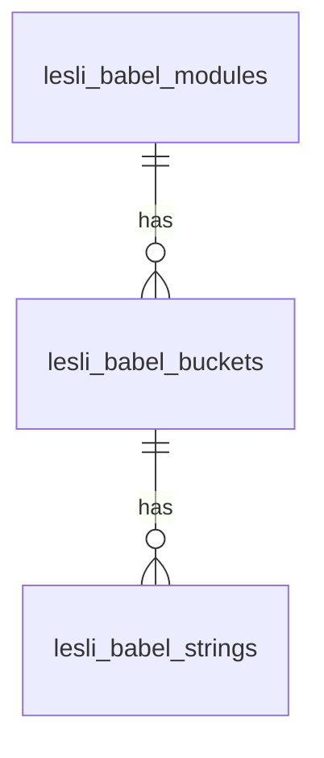

<script setup>
    import LesliBrowser from "../../.vitepress/components/lesli-browser.vue"
</script>

<header align="center" class="lesli-page-header">
    
    <h2>
        Translation Management System for the <br />
        <span class="lesli-title-colored">Lesli Framework.</span>
    </h2>
</header>

In the dynamic world of web development, creating multilingual applications is a necessity. To streamline the process of managing translations in Rails applications, we proudly introduce LesliBabel – a powerful and versatile module designed to simplify the complexities of handling multilingual content.


LesliBabel is a translation management module specifically crafted for the Lesli Framework but compatible with Ruby on Rails standard apps. It provides users with a robust set of tools to efficiently handle string translations across multiple languages. With LesliBabel, the process of managing, modifying, adding, and translating strings becomes an intuitive and seamless experience.

<lesli-browser url="babel">
    
</lesli-browser>

<hr />


### Key Features:

**Centralized Translation Hub:**
LesliBabel serves as a centralized hub for all your translation needs. Accessible through a user-friendly interface that users can efficiently oversee and manage translations for their applications, you don't need technical experience to work with JSON or YML files to add new strings or to translate them.

**Multi-Language Support:**
Supporting a plethora of languages, LesliBabel allows developers to create applications that cater to a global audience. Easily add and update translations for different locales without breaking a sweat.

**String Modification and Addition:**
LesliBabel simplifies the process of modifying and adding new strings to your application. The module ensures that the translation workflow seamlessly integrates into your Rails development environment, providing a well designed structure to group translations by apps (rails engines), buckets (Controllers) and components (UI elements).

**Translation Workflow:**
LesliBabel comes equipped with a streamlined translation workflow. Developers can effortlessly translate strings, review pending translations, and ensure the accuracy of content across various languages.

<hr />


### The database:

LesliBabel works with a simple 3 tables, this to ensure a minimum level of relationship between entities.



<hr />


### Modules

Modules has a single record for every engine you have installed in the host Rails app, this record acts as main owner of the all translations that belongs to this specific engine.

::: info
The host app is also considered as a module.
:::


<lesli-browser url="babel">
    
</lesli-browser>

<hr />


### Buckets

Buckets is a representation for every controller registered in the routes file of the engine. The following example represent two different buckets of strings inside LesliBabel:

```ruby
Rails.application.routes.draw do
  resources :users
  resources :posts
end
```

Buckets basically acts as containers for all the translations that belongs to an app that works under an specific route.


<lesli-browser url="babel">
    
</lesli-browser>

<hr />


### Strings

Finally, this table has the strings that we are going to use into our application (we can use this strings into ruby or javascript code), inside lesli_babel_strings we can find a record for every strings we want to translate.

Example:

| string | en | es | it | fr |
|---	|---	|---	|---	|---	|
| hello | Hello | Hola | Ciao | Bonjour |
| bye | Bye | Adios | Ciao | au revoir |

<hr />


### The editor
LesliBabel includes a useful web editor, eliminating the need for technical skills to edit translations. This feature enables users to collaborate on translations effectively.

The translation editor offers a straightforward yet valuable interface, allowing you to easily check the status of all translations.

<lesli-browser url="babel">
    
</lesli-browser>

You have the capability to expand each string container, providing you with a comprehensive view of the individual strings and their corresponding translations for every supported language. This feature allows for in-depth inspection and modification, empowering users to meticulously review and update translations in a user-friendly manner. The detailed view within the string container simplifies the translation management process.

<lesli-browser url="babel">
    
</lesli-browser>

You can check an online demo of this module at: [https://demo.lesli.dev/babel](https://demo.lesli.dev/babel)
