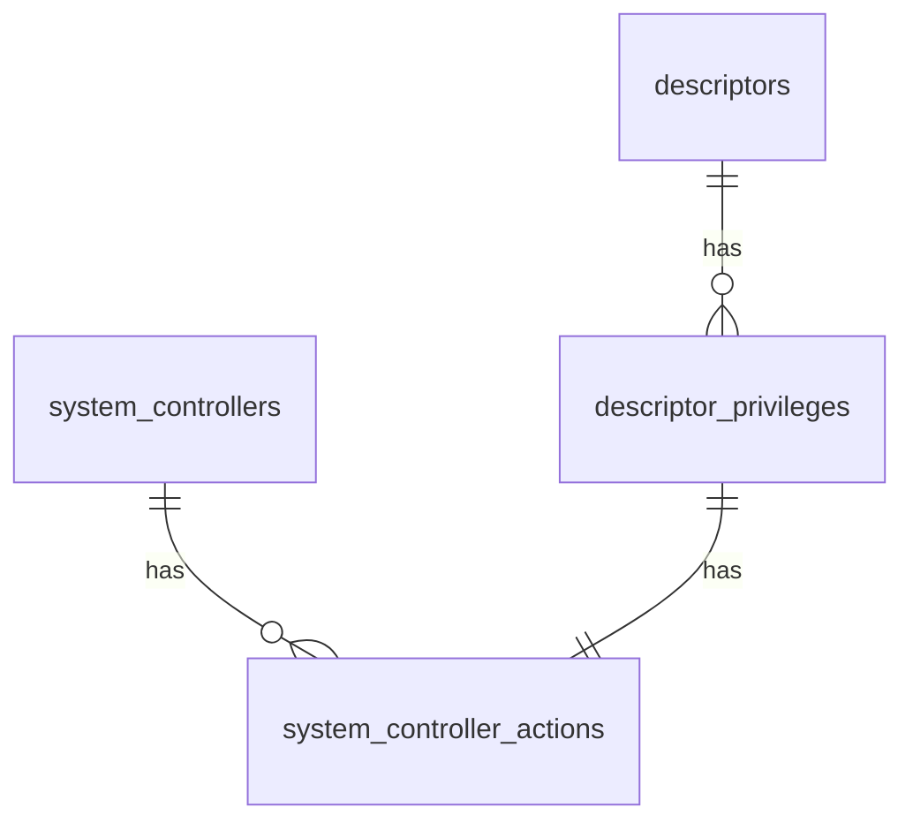

# Descriptors

A descriptor in the context of the Lesli Security gem is a collection of rails controllers and actions paths, this means we store in the database the route of every controller and their corresponding actions registered in the route.rb file.

Example: 

| Controller | Action | Allowed |
|---	|---	|---    |
| Users | index | true  |
| Users | show  | true  |
| Users | create | true |
| Users | edit   | true |
| Users | delete | false |

Of course to have a well designed and a good integrity in the database we have to split this into multiples tables:

- System controllers: All the controllers registered in the routes.rb file.
- System controller actions: The actions available in every controller.
- Descriptors: Just the head of the descriptor map.
- Descriptor privileges: The relation and status between controller, action and descriptor.

Using this database structure we can create a view to manage the collection of controllers/actions that belongs to a descriptor:

<section class="lesli-documentation-footer">
    
<a target="blank" href="https://github.com/LesliTech/LesliSecurity/tree/master/docs/descriptors.md"><i class="ri-external-link-fill"></i>&nbsp;Edit this page</a>

    
<b>Last Update: </b>2024/09/29 22:48

</section>
<!-- This code was automatically generated -->
<!-- to update this docs please run rake docs:build -->
