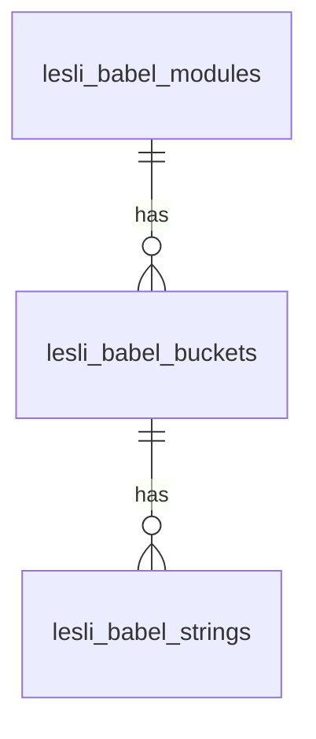

# 09.01 CloudBabel Database

```plaintext
    10.01. modules

    11.01. buckets

    12.01. strings
    12.04. string/activities
```



<section class="lesli-documentation-footer">
    <p><a><i class="ri-external-link-fill"></i>&nbsp;Edit this page</a><p/>
    <p><b>Last Update: </b>2024/09/29 22:48</p>
</section>
<!-- This code was automatically generated -->
<!-- to update this docs please run rake docs:build -->
